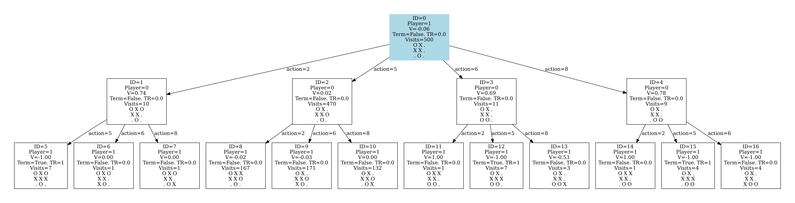

# MCTS for Two-Player Games
This repository implements the Monte Carlo Tree Search (MCTS) algorithm for zero-sum, two-player games.

Tic-Tac-Toe is used as the main example for demonstrating the algorithm.

# Tic Tac Toe
We have implemented the Tic-Tac-Toe game in `tic_tac_toe.py`. The game class inherits from the `TwoPlayerGame` abstract class, which defines the API required for our MCTS implementation. Additionally, tests for the Tic-Tac-Toe game are provided in `test_tic_tac_toe.py`.

# MCTS test
To test our MCTS implementation, you can run the `play_tic_tac_toe.py` script. This allows you to play Tic-Tac-Toe against a computer opponent that uses MCTS to determine its moves.

# Visualization of the MCTS tree
You can visualizate the MCTS by passing `dump_tree_to_file=True` to `get_best_action` method. This will create two files: `mcts_tree.pdf` - visualization of the tree and `tree.txt` - dump of the tree in text format. The visualization is restricted to only show first 3 levels of the tree to avoid making very wide .pdf files, which can't be displayed properly.

# API
Use `play_tic_tac_toe.py` an an example.